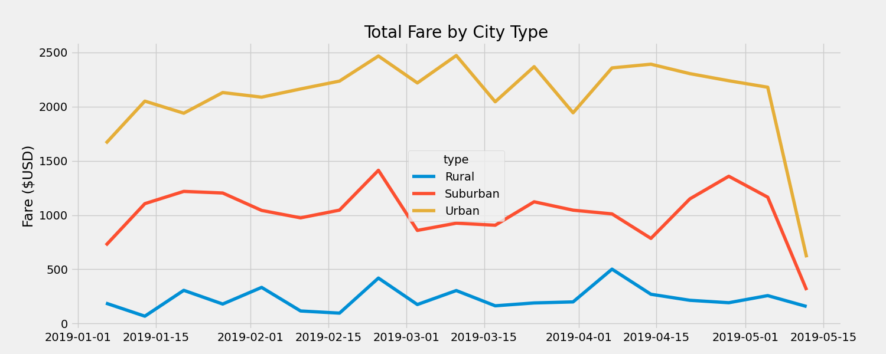

# PyBer_Analysis

## Analysis Overview

### Purpose
The new analysis summarizes the PyBer data by showing the total number of rides, number of drivers, and the sum fares of each type of city. In the analysis, the data was used to retrieve the average fare per ride and the average fare per driver in each type of city. The analysis also includes a visualization of the total weekly sum of fares for each type of city.

### Results
The analysis shows that there is a noticeable discrepency in the total fares and average fares between each type of city. For instance, the total fares of rural cities ($4328) are only around 22% of suburban cities ($19356) and 11% of the size of urban cities ($39854). Although rural cities generate less total fares, the average fare per driver of rural cities ($8.06) is about 4 times as much as suburban cities ($2.26) and 8 times as much as urban cities ($0.67). The analysis indicates this may be caused from the low amount of total rides and drivers within rural cities (125 rides, 537 drivers), compared to suburban (625 rides, 8570 drivers) and urban cities (1625 rides, 59602 drivers). For example, since suburban and urban cities have a far greater number of total drivers and total rides, the average fares will not be as large as rural cities.

### Summary
According to the data, driver support is needed mostly in rural cities.

#### Visualization

